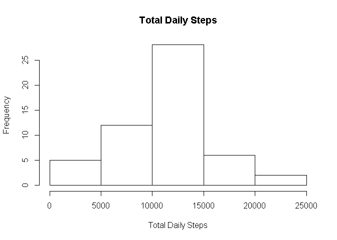
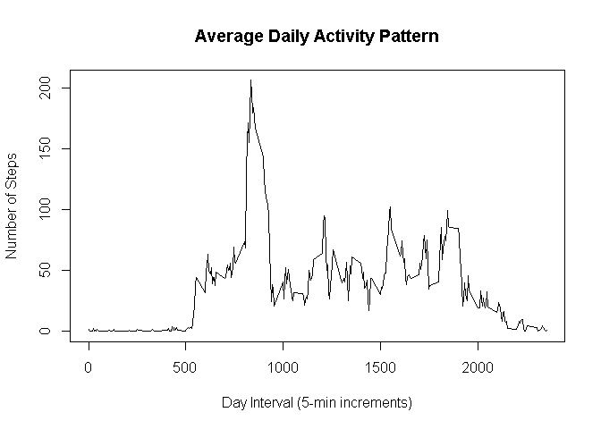
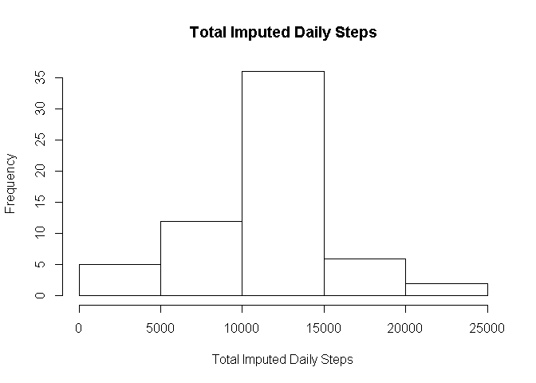
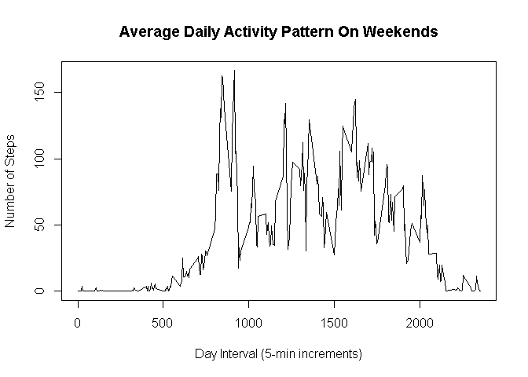
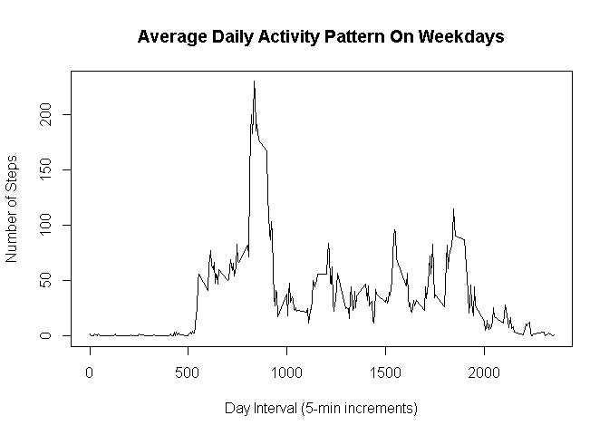

# Reproducible Research: Peer Assessment 1


## Loading and preprocessing the data 
Load the data and also get a subset without missing values 

```r
library(plyr)

data <- read.csv('activity.csv')
data_full <- data[complete.cases(data), ]
```


## What is mean total number of steps taken per day? 
Histogram of the total number of steps taken each day 

```r
daily_steps <- ddply(data_full, .(date), summarize, steps = sum(steps))

hist(
    daily_steps$steps, 
    xlab='Total Daily Steps', 
    main='Total Daily Steps'
  )
```

 
  
The mean total number of steps taken per day 

```r
mean(daily_steps$steps)
```

```
## [1] 10766.19
```
  
The median total number of steps taken per day 

```r
median(daily_steps$steps)
```

```
## [1] 10765
```

## What is the average daily activity pattern? 
Time series plot of the 5-minute interval (x-axis) and the average number of steps taken, averaged across all days (y-axis) 

```r
# avg steps for each interval from all days
interval_steps <- ddply(data_full, .(interval), summarize, steps = mean(steps))

plot(
    interval_steps$interval, 
    interval_steps$steps, 
    type='l',
    xlab='Day Interval (5-min increments)',
    ylab='Number of Steps',
    main='Average Daily Activity Pattern'
  )
```

 
 
Which 5-minute interval, on average across all the days in the dataset, contains the maximum number of steps? 

```r
most_steps <- max(interval_steps$steps) # interval with most steps across all days
interval_steps[interval_steps$steps == most_steps, ]
```

```
##     interval    steps
## 104      835 206.1698
```
 
## Imputing missing values 
Total number of missing values in the data set: 

```r
sum(is.na(data))
```

```
## [1] 2304
```
 
Attempt to fill in all of the missing values in the dataset by setting NA to avg steps for that interval

```r
# rename the steps col for easy access after join
colnames(interval_steps) <- c('interval', 'steps_avg')

# add average steps col. per interval for each obs. in data
data_imputed <- join(data, interval_steps, by='interval')

# set each NA to the average steps for that interval
data_imputed$steps[is.na(data_imputed$steps)] <- round(data_imputed$steps_avg[is.na(data_imputed$steps)])
```
 
 
Histogram of the total number of steps taken each day and Calculate and report the mean and median total number of steps taken per day 

```r
daily_steps_imputed <- ddply(data_imputed, .(date), summarize, steps = sum(steps))

hist(
    daily_steps_imputed$steps, 
    xlab='Total Imputed Daily Steps', 
    main='Total Imputed Daily Steps'
  )
```

 

The mean total number of imputed steps taken per day 

```r
mean(daily_steps_imputed$steps)
```

```
## [1] 10765.64
```

The median total number of imputed steps taken per day 

```r
median(daily_steps_imputed$steps)
```

```
## [1] 10762
```

### Conclusion about imputed data
The mean and median values of imputed data are very close to the mean and median of clean data. 

The frequency of total daily imputed steps is higher according to the histogram.  
This is due to a higher total number of steps in the imputed data, since NA values were replaced by estimates. 
 
## Are there differences in activity patterns between weekdays and weekends? 
Create a new factor variable in the dataset with two levels -- "weekday" and "weekend" indicating whether a given date is a weekday or weekend day.  

Add weekend/weekday columns, and calculate mean steps for each 5-min interval on a weekend or a weekday

```r
# add day of the week to each obs.
data_imputed$day_of_week <- weekdays(as.Date(data_imputed$date))

# based on data above, create part_of_week for each obs.
data_imputed$part_of_week <- ifelse(data_imputed$day_of_week %in% c("Saturday", "Sunday"),"weekend", "weekday")

# compute mean steps for each interval on weekend vs weekday
week_mean <- ddply(data_imputed, .(interval, part_of_week), summarize, steps=mean(steps))
```
  
  
Plot the activity for weekend vs weekday

```r
# timeseries for weekend
plot(
    week_mean[week_mean$part_of_week == 'weekend', 'interval'],
    week_mean[week_mean$part_of_week == 'weekend', 'steps'],
    type='l',
    xlab='Day Interval (5-min increments)',
    ylab='Number of Steps',
    main='Average Daily Activity Pattern On Weekends'
  )
```

 

```r
# timeseries for weekday
plot(
    week_mean[week_mean$part_of_week == 'weekday', 'interval'],
    week_mean[week_mean$part_of_week == 'weekday', 'steps'],
    type='l',
    xlab='Day Interval (5-min increments)',
    ylab='Number of Steps',
    main='Average Daily Activity Pattern On Weekdays'
  )
```

 
